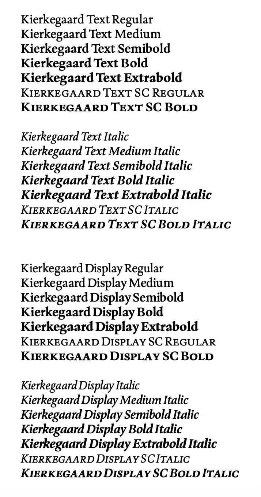
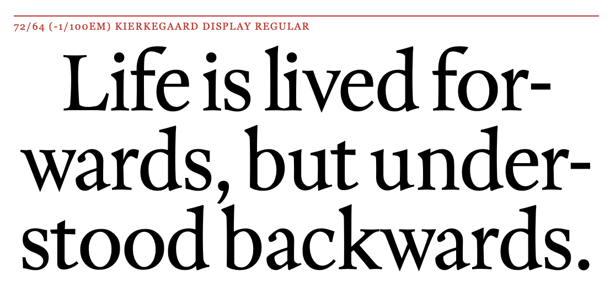
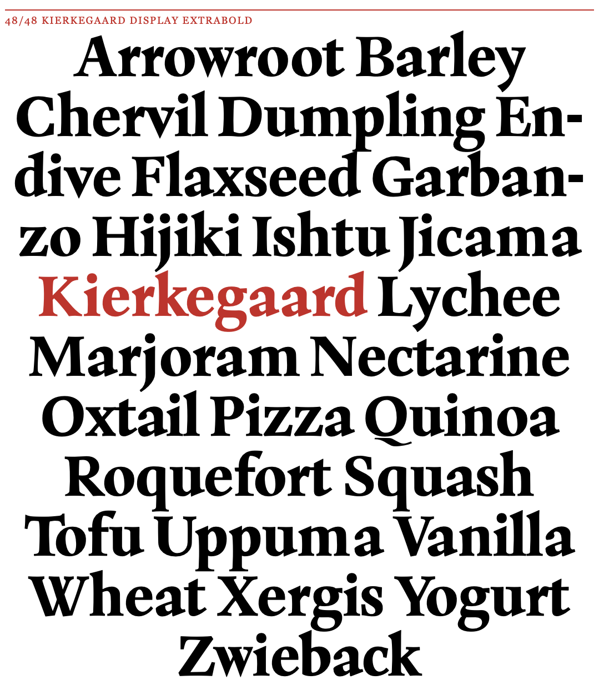
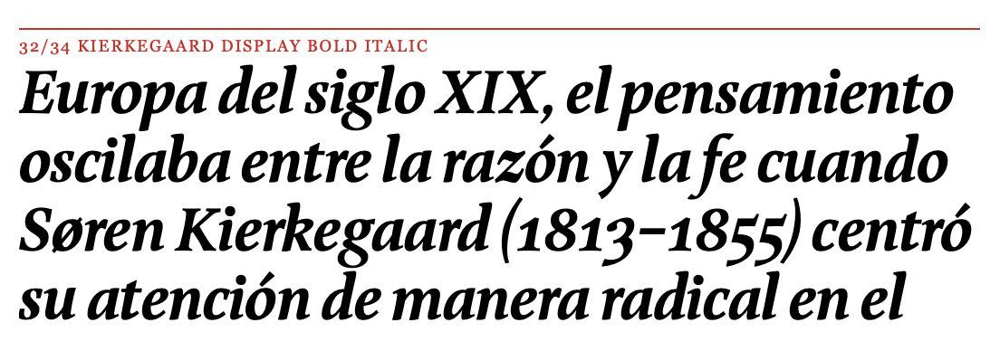
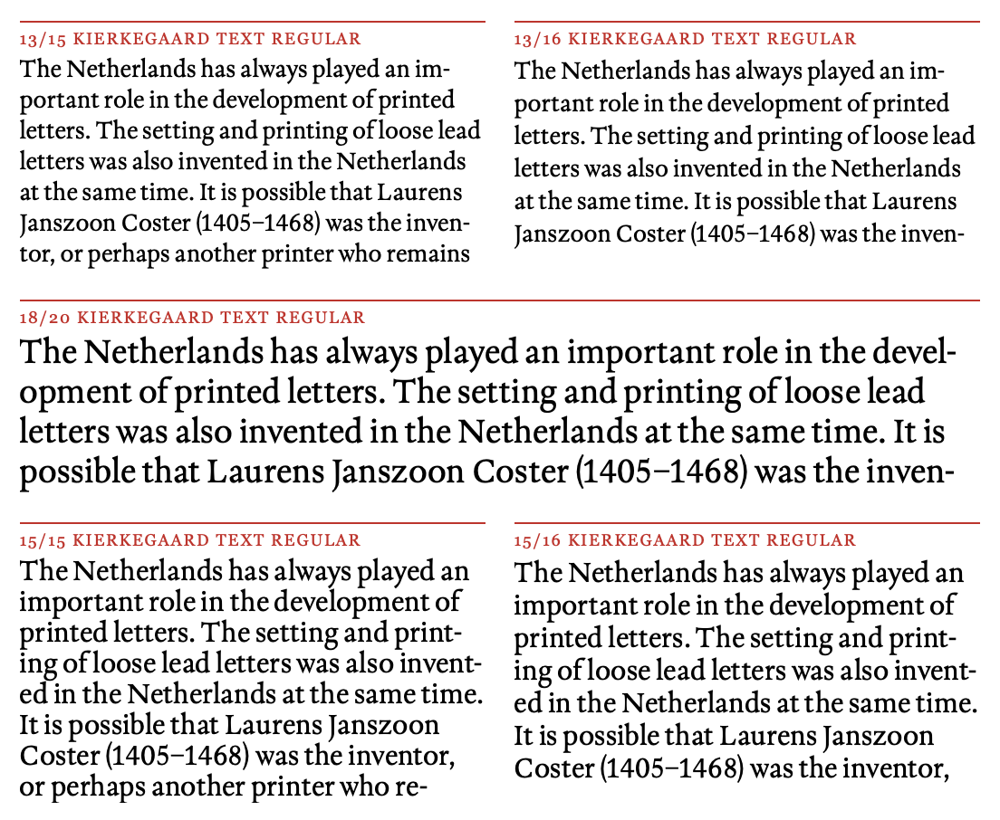
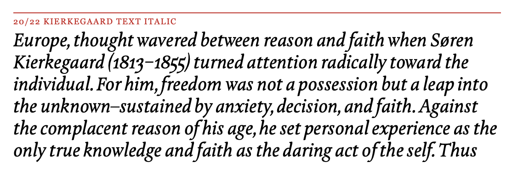
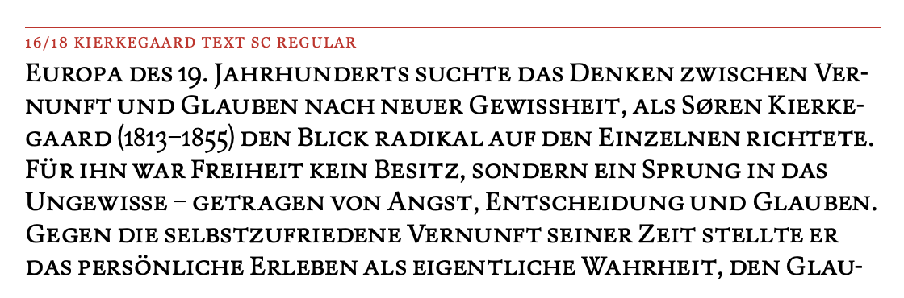

# Kierkegaard Font Project
    
Kierkegaard is a modern serif typeface in renaissance style that merges historical grace with contemporary precision. Drawing inspiration from the philosophical spirit of Søren Aabye Kierkegaard (1813–1855), this type family celebrates the creative potential born from constraint — echoing Kierkegaard’s insight that “The more one limits oneself, the more resourceful one becomes”

Quote from Kierkegaard set in Kierkegaard

At its core, Kierkegaard embodies this principle through restraint and refinement. The design balances the organic flow of broad-nib calligraphy with the structural clarity of modern typography. Each letterform is carefully modeled with subtly curved stems, allowing the font to convey warmth and humanity within a rational, typographic framework.

The result is a typeface that feels both timeless and alive — rooted in the heritage of Renaissance serifs yet adaptable for contemporary design needs. From editorial layouts to branding, long-form text, and digital interfaces, <strong>Kierkegaard</strong> lends a thoughtful and intellectual tone without losing approachability.

Sample set of uppercase and lowercase letters showing the characteristic curved stems and broad-nib modulation.

## Design Features

Kierkegaard’s anatomy reflects a dialogue between philosophy and form. The slightly curved stems interpret the motion of natural handwriting, suggesting the trace of a broad nib. This approach creates a dynamic rhythm across lines of text, offering an elegant reading experience.

Every glyph in Kierkegaard has been designed to support thoughtful expression. The balance of classical proportion and modern restraint makes it suitable for designers seeking harmony between intellectual depth and visual simplicity.

Weight range overview — from Light to Bold, including italics — illustrating contrast and balance.

## Philosophy and Inspiration

Kierkegaard’s design process was guided by the same spirit of creative discipline that defines the philosopher’s work. Limitation, in this context, becomes a source of invention — a principle translated into the precise modulation of curves and counters. The typeface invites designers to work within a coherent visual system while discovering freedom through structure.

Just as Søren Kierkegaard urged thinkers to explore beyond the boundaries of convention, this font encourages typographers to reimagine the limits of traditional serif design. Its name pays homage to the philosopher not merely as a historical figure but as a symbol of introspection, creativity, and human depth.

Editorial layout presenting readability and tone in printed media.

## Applications

With its combination of expressive detail and robust functionality, Kierkegaard is designed to perform beautifully in both print and digital environments. It excels in editorial design, book typography, academic publishing, and refined brand identities that value craftsmanship and clarity.

Kierkegaard’s thoughtful proportions and legible texture make it a versatile companion for projects where tone and intellect intertwine — from contemplative essays to minimalist websites.

UI on screen devices demonstrating Kierkegaard in digital media.

## License
Kierkegaard is available under the <a href="https://scripts.sil.org/OFL" target="_blank" rel="noopener noreferrer">Open Font License (OFL)</a>, allowing designers, developers, and organizations to freely use, modify, and share the typeface while preserving its integrity and attribution.

## The members of the Kierkegaard family

The Kierkegaard typeface family now comprises 40 styles, also available as variable fonts with 3 axis (opsz, wght, ital)

Now available: a new Display cut for Headlines

Available in all weights: Regular, Medium, SemiBold, Bold, and Extrabold

Complete with true italic typefaces

Complementing the Text cuts for body copy

Also featuring true italic letterforms

Plus small capitals across all cuts

## Character Maps

Each of them containing 865 Glyphs

The Character set

- [Character set](documentation/maps/charset-KierkegaardText-Regular.html.pdf)

The construction plans of the glyphs

- [Construction plans](documentation/maps/atlas-KierkegaardText-Regular.html.pdf)

## Specimen Books

Please also have a look at the specimen book

180 pages full of different samples

- [Font Specimen](documentation/specimens/SpecimenNL.pdf)

But you can also read a sample text in one of the specimen books

- [Brentano (German)](documentation/specimens/Brentano.pdf)
- [Cicero (Latin)](documentation/specimens/Cicero.pdf)
- [Crops (English)](documentation/specimens/Crops.pdf)
- [Dumas (French)](documentation/specimens/Dumas.pdf)
- [Enrödi (Hungarian)](documentation/specimens/Endrődi.pdf)
- [Etik (Danish)](documentation/specimens/Endrődi.pdf)
- [Heisenberg (Vietnamese)](documentation/specimens/Heisenberg.pdf)
- [Martens (Dutch)](documentation/specimens/Martens.pdf)
- [Picon (Spanish)](documentation/specimens/Picon.pdf)
- [Woolf (English)](documentation/specimens/Woolf.pdf)

## Online Preview and Download 

But if you would like to have an digital animated and interactive view and a font tester to have some custom edits:

Give a try at the fonts landing page also with specimen and download 

[Test the typeface online](https://jrgdrs.github.io/Kierkegaard/)

## Issue Support

If you have ideas or requests, please share it here:

The font project github ticket system to follow 

[Ticket system](https://github.com/jrgdrs/Kierkegaard/issues)

 