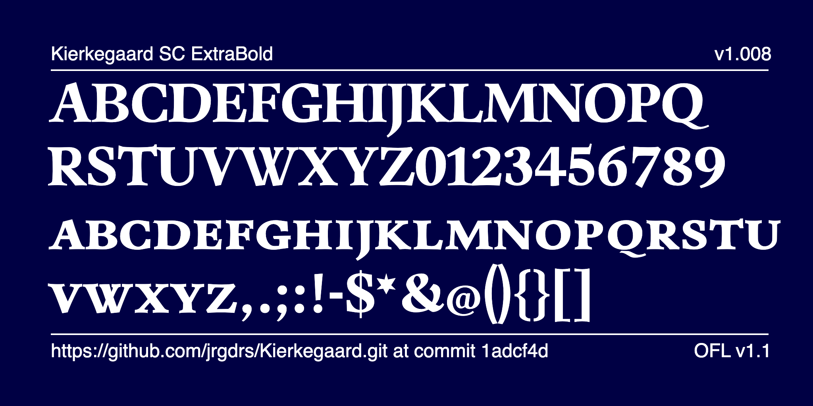

# Kierkegaard Font Project

Kierkegaard is a modern Renaissance serif font with slightly curved stems. The family contains 20 members in 5 weights companied with an italic, old style figures and small characters.

### The members of the Kierkegaard family

400

500

600

700

800

### Specimen sheets

[Download the Specimen file (PDF)](documentation/SpecimenNL.html.pdf)

## About

Kierkegaard is a typeface from from Jörg Drees 

## --

## Building

Fonts are built automatically by GitHub Actions - take a look in the "Actions" tab for the latest build.

If you want to build fonts manually on your own computer:

- `make build` will produce font files.
- `make test` will run [FontBakery](https://github.com/googlefonts/fontbakery)'s quality assurance tests.
- `make proof` will generate HTML proof files.

The proof files and QA tests are also available automatically via GitHub Actions - look at https://jrgdrs.github.io/Kierkegaard.git.

## Changelog

When you update your font (new version or new release), please report all notable changes here, with a date.
[Font Versioning](https://github.com/googlefonts/gf-docs/tree/main/Spec#font-versioning) is based on semver.

## License

This Font Software is licensed under the SIL Open Font License, Version 1.1.
This license is available with a FAQ at https://openfontlicense.org

## Repository Layout

This font repository structure is inspired by [Unified Font Repository v0.3](https://github.com/unified-font-repository/Unified-Font-Repository), modified for the Google Fonts workflow.
 