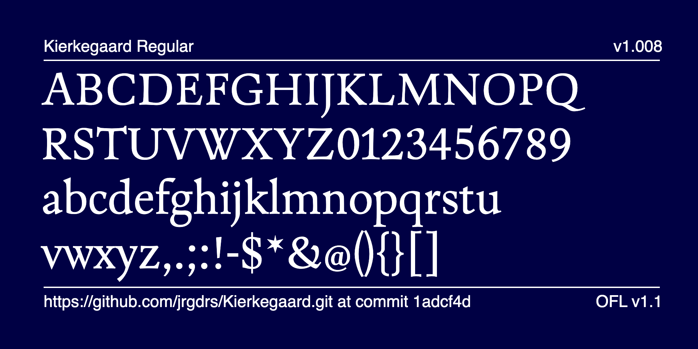
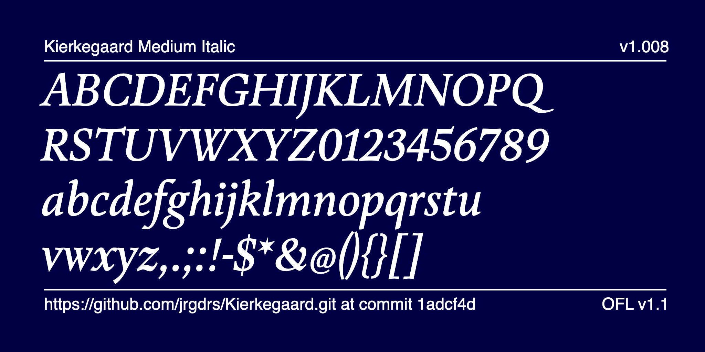
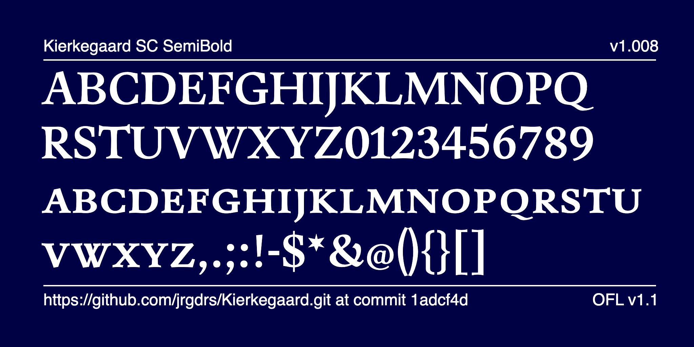
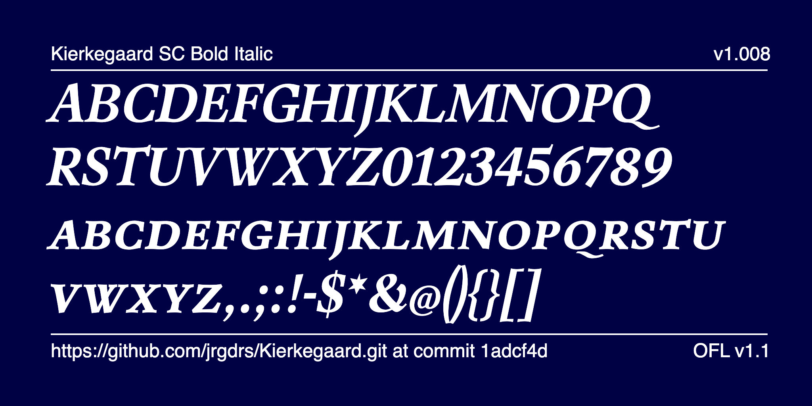

# Kierkegaard Font Project
    
Kierkegaard is a modern serif typeface in renaissance style that merges historical grace with contemporary precision. Drawing inspiration from the philosophical spirit of Søren Aabye Kierkegaard (1813–1855), this type family celebrates the creative potential born from constraint — echoing Kierkegaard’s insight that “The more one limits oneself, the more resourceful one becomes”

Quote from Kierkegaard set in Kierkegaard

At its core, Kierkegaard embodies this principle through restraint and refinement. The design balances the organic flow of broad-nib calligraphy with the structural clarity of modern typography. Each letterform is carefully modeled with subtly curved stems, allowing the font to convey warmth and humanity within a rational, typographic framework.

The result is a typeface that feels both timeless and alive — rooted in the heritage of Renaissance serifs yet adaptable for contemporary design needs. From editorial layouts to branding, long-form text, and digital interfaces, <strong>Kierkegaard</strong> lends a thoughtful and intellectual tone without losing approachability.

Sample set of uppercase and lowercase letters showing the characteristic curved stems and broad-nib modulation.

## Design Features

Kierkegaard’s anatomy reflects a dialogue between philosophy and form. The slightly curved stems interpret the motion of natural handwriting, suggesting the trace of a broad nib. This approach creates a dynamic rhythm across lines of text, offering an elegant reading experience.

The complete family contains 20 members in five weights, each paired with a matching italic. Additional features include old-style figures, small capitals, and refined character detailing for professional typographic versatility.

Every glyph in Kierkegaard has been designed to support thoughtful expression. The balance of classical proportion and modern restraint makes it suitable for designers seeking harmony between intellectual depth and visual simplicity.

Weight range overview — from Light to Bold, including italics — illustrating contrast and balance.

## Philosophy and Inspiration

Kierkegaard’s design process was guided by the same spirit of creative discipline that defines the philosopher’s work. Limitation, in this context, becomes a source of invention — a principle translated into the precise modulation of curves and counters. The typeface invites designers to work within a coherent visual system while discovering freedom through structure.

Just as Søren Kierkegaard urged thinkers to explore beyond the boundaries of convention, this font encourages typographers to reimagine the limits of traditional serif design. Its name pays homage to the philosopher not merely as a historical figure but as a symbol of introspection, creativity, and human depth.

Editorial layout mockup demonstrating Kierkegaard’s readability and tone in print and digital media.

## Applications

With its combination of expressive detail and robust functionality, Kierkegaard is designed to perform beautifully in both print and digital environments. It excels in editorial design, book typography, academic publishing, and refined brand identities that value craftsmanship and clarity.

Kierkegaard’s thoughtful proportions and legible texture make it a versatile companion for projects where tone and intellect intertwine — from contemplative essays to minimalist websites.

## License
Kierkegaard is available under the <a href="https://scripts.sil.org/OFL" target="_blank" rel="noopener noreferrer">Open Font License (OFL)</a>, allowing designers, developers, and organizations to freely use, modify, and share the typeface while preserving its integrity and attribution.

## The members of the Kierkegaard family

400

500

600

700

800

## Specimen sheets

[Download the Specimen file (PDF)](documentation/SpecimenNL.html.pdf)

## Building

Fonts are built automatically by GitHub Actions - take a look in the "Actions" tab for the latest build.

If you want to build fonts manually on your own computer:

- `make build` will produce font files.
- `make test` will run [FontBakery](https://github.com/googlefonts/fontbakery)'s quality assurance tests.
- `make proof` will generate HTML proof files.

The proof files and QA tests are also available automatically via GitHub Actions - look at https://jrgdrs.github.io/Kierkegaard.git.

## Changelog

When you update your font (new version or new release), please report all notable changes here, with a date.
[Font Versioning](https://github.com/googlefonts/gf-docs/tree/main/Spec#font-versioning) is based on semver.

## License

This Font Software is licensed under the SIL Open Font License, Version 1.1.
This license is available with a FAQ at https://openfontlicense.org

## Repository Layout

This font repository structure is inspired by [Unified Font Repository v0.3](https://github.com/unified-font-repository/Unified-Font-Repository), modified for the Google Fonts workflow.
 
 